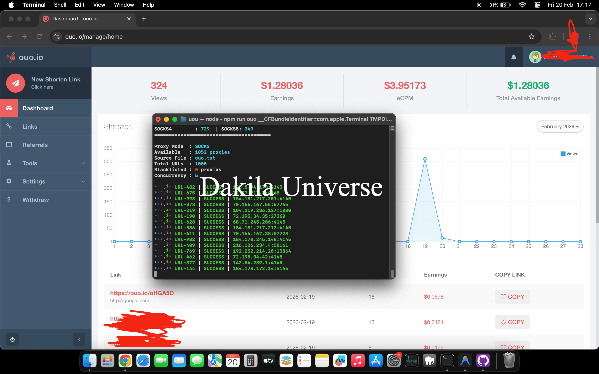

# OUO.IO Link Navigator

Solusi otomatisasi navigasi tautan OUO.IO yang dibangun di atas Puppeteer. Dirancang dengan arsitektur multi-worker konkuren, rotasi proxy SOCKS otomatis, dan emulasi browser mobile untuk memastikan keandalan navigasi yang optimal.

## Fitur

- **Navigasi Otomatis** — Mengelola seluruh alur navigasi tautan OUO.IO dari awal hingga selesai.
- **Rotasi Proxy SOCKS** — Mengambil dan merotasi proxy SOCKS4/5 dari sumber publik secara otomatis.
- **Pemrosesan Konkuren** — Menjalankan beberapa worker secara paralel untuk throughput maksimal.
- **Emulasi Browser Mobile** — Mensimulasikan perilaku browser mobile nyata untuk navigasi yang konsisten dan andal.
- **Filter Iklan** — Memblokir request domain iklan secara otomatis untuk mempercepat waktu muat halaman.
- **Operasi Headless** — Berjalan sepenuhnya di latar belakang tanpa antarmuka visual.
- **Distribusi URL Acak** — Mengacak urutan pemrosesan URL untuk distribusi beban yang merata.



## Prasyarat

Pastikan perangkat lunak berikut telah terpasang sebelum memulai:

- **Node.js** `>= 20.0.0`
- **NPM** — Node Package Manager (sudah termasuk dalam paket Node.js)
- **Git** — Untuk mengkloning repositori
- **Koneksi Internet Stabil** — Diperlukan untuk pengambilan proxy dan proses navigasi

## Instalasi

1. **Clone Repositori**

    ```bash
    git clone https://github.com/Tianndev/uou.git
    cd uou
    ```

2. **Instal Dependensi**

    ```bash
    npm install
    ```

## Konfigurasi

### Daftar URL

Buat file `ouo.txt` di dalam direktori `data/`, lalu isi dengan URL OUO.IO target — satu URL per baris.

**Lokasi:** `data/ouo.txt`

```text
https://ouo.io/contoh1
https://ouo.io/contoh2
https://ouo.io/contoh3
```

### Parameter Lanjutan

Sesuaikan konfigurasi melalui objek `CONFIG` di dalam `main.js`:

```javascript
const CONFIG = {
    useProxy: true,                    // Aktifkan/nonaktifkan proxy
    ouoFile: 'data/ouo.txt',           // Lokasi file daftar URL
    headless: 'new',                   // 'new' = headless, false = tampilkan browser
    timeout: 50000,                    // Batas waktu operasi (ms)
    consecutiveFailureThreshold: 2,    // Batas toleransi kegagalan berturut-turut
    concurrency: 5,                    // Jumlah worker yang berjalan bersamaan
};
```

## Penggunaan

```bash
npm run ouo
```

Setelah dijalankan, aplikasi akan mengambil daftar proxy, mengacak urutan URL, lalu mulai memproses setiap tautan secara konkuren. Status dan laporan akhir akan ditampilkan langsung di terminal.

## Penafian

Perangkat lunak ini disediakan semata-mata untuk keperluan riset, edukasi, dan pengujian teknis. Penulis tidak bertanggung jawab atas segala bentuk penyalahgunaan atau konsekuensi yang timbul dari penggunaan alat ini. Pengguna sepenuhnya bertanggung jawab untuk memastikan kepatuhan terhadap hukum dan ketentuan layanan yang berlaku.

## Lisensi

Hak Cipta © 2026 **Dakila Universe**. Semua Hak Dilindungi.

Dilarang keras menyalin, memodifikasi, mendistribusikan, atau menggunakan perangkat lunak ini tanpa izin tertulis dari pemegang hak cipta.